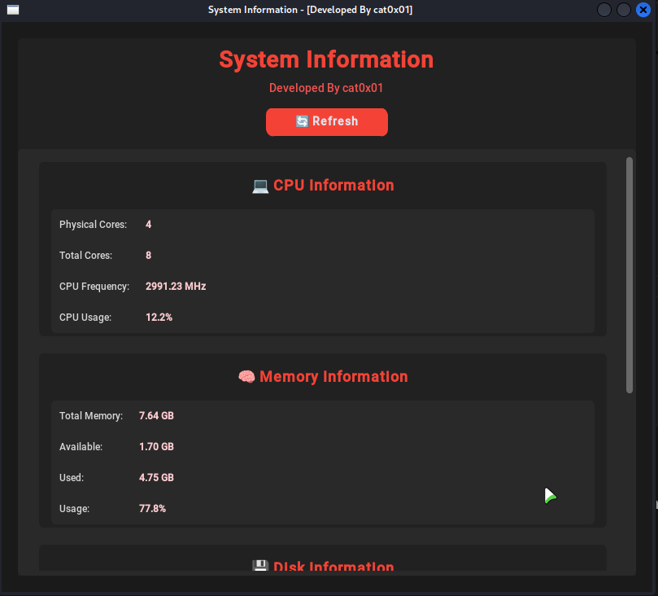

### System Information GUI 🖥️

A simple Python desktop application that displays detailed system and hardware information in a clean and user-friendly graphical interface.

This tool is built using CustomTkinter and psutil, and allows users to quickly view CPU, memory, disk, and operating system details with a single click.

### ✨ Features

📊 CPU Information

Physical cores

Total cores

CPU frequency

Real-time CPU usage

🧠 Memory Information

Total memory

Available memory

Used memory

Usage percentage

💾 Disk Information

Total disk space

Used space

Free space

Disk usage percentage

🖥️ System Information

Operating system

Processor

Platform details

🔄 Refresh button to update all stats instantly

🌙 Dark mode interface with red accent theme

Beginner-friendly and easy to use

### 🛠️ Built With

```

Python 3

customtkinter

psutil

platform (standard library)

```

### 🚀 Installation & Usage

1. Clone the repository

```python

git clone https://github.com/yourusername/system-information-gui.git
cd system-information-gui

```

2. Install requirements

```pip install psutil customtkinter```

3. Run the tool

```python

python pc_info_gui.py

```
### 📌 Use Cases

Viewing system hardware information

Learning Python GUI development

Monitoring basic system resources

Educational and personal use

⚠️ This tool is intended for educational and informational purposes only.

### 📷 Preview





### 📝 Note

These projects were developed a long time ago.I recently decided to share them publicly so others can benefit from them.At the time, I was not familiar with Git or GitHub, and the projects were created independently before being published here.

### 👤 Author

Developed by cat0x01

